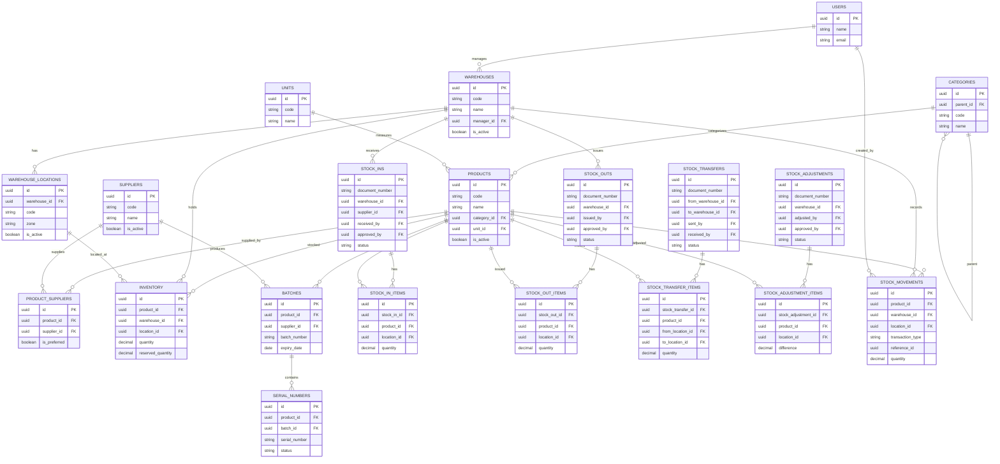
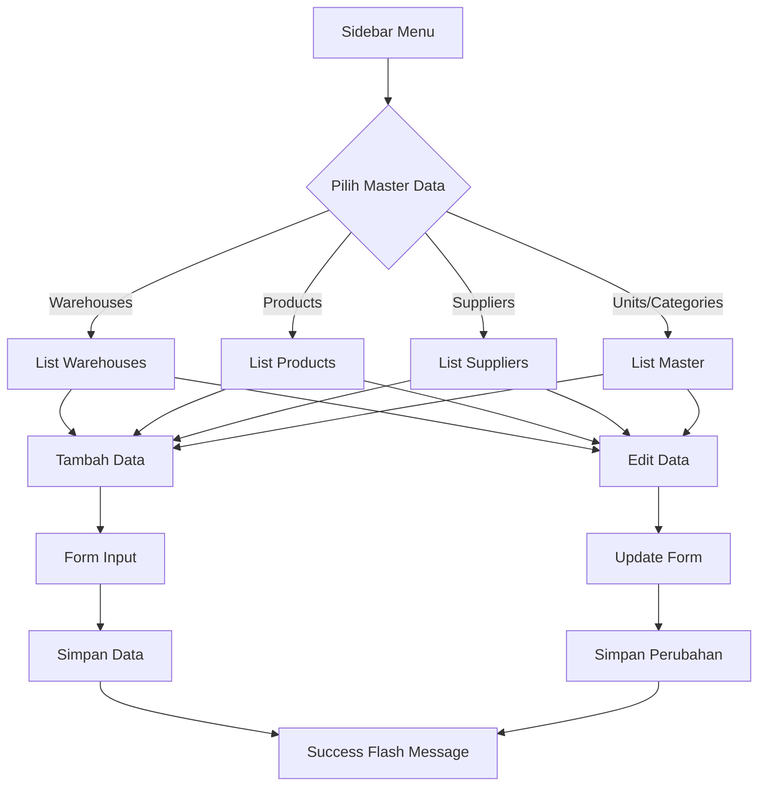
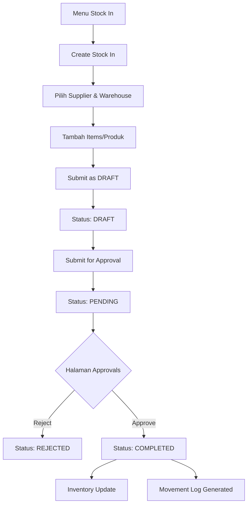
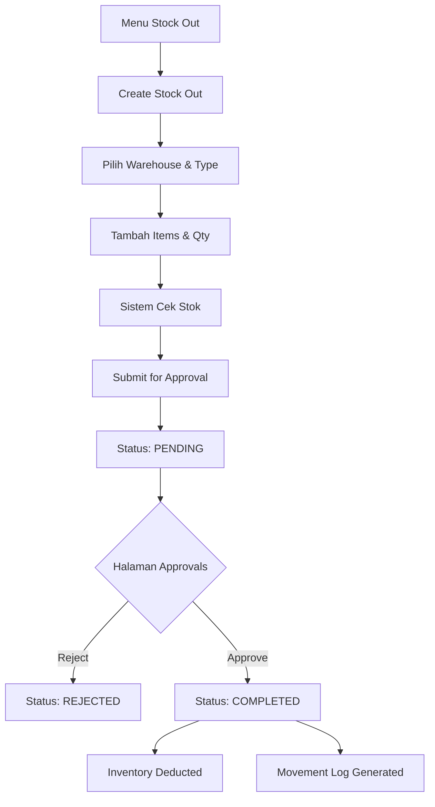
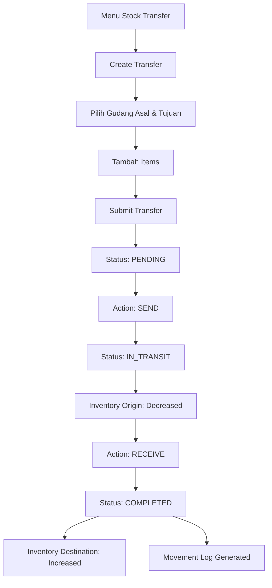
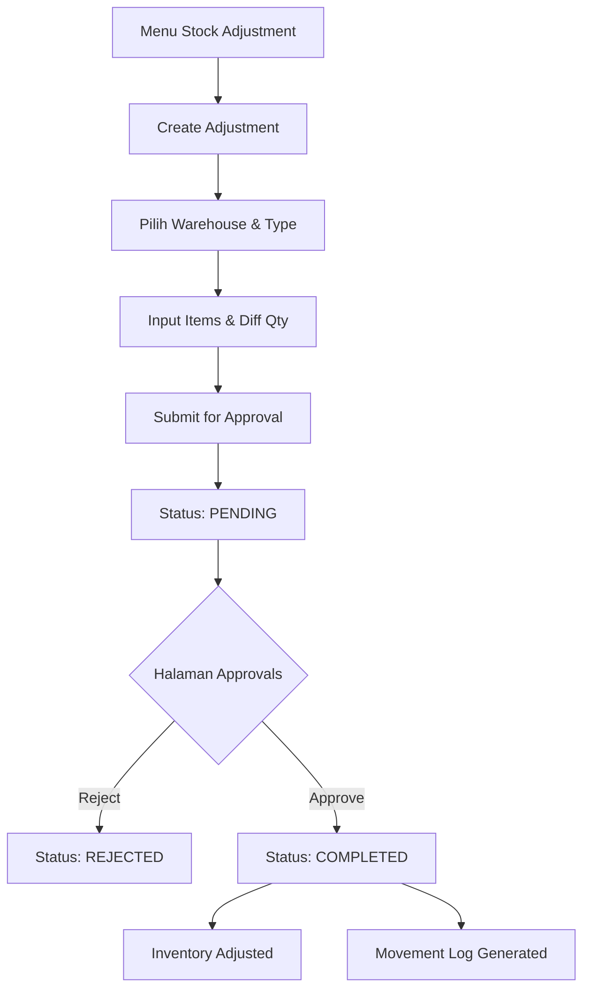
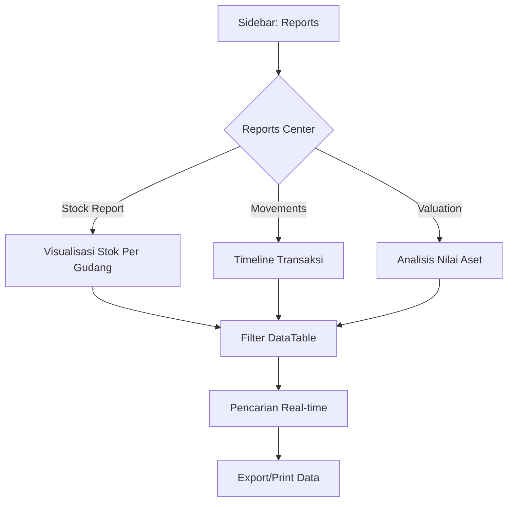
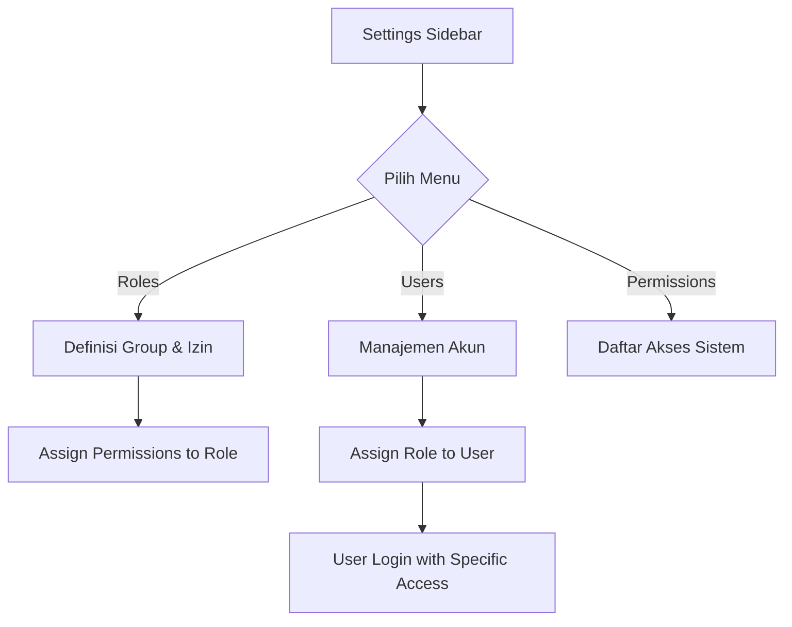

# Agusto - Integrated Warehouse Management System

Agusto adalah sistem manajemen gudang (Warehouse Management System) tingkat lanjut yang dibangun dengan Laravel. Aplikasi ini dirancang untuk memberikan kontrol penuh atas inventaris, pelacakan stok secara real-time, manajemen lokasi multi-gudang, dan alur kerja persetujuan yang terstruktur.

## ✨ Fitur Utama

- **Real-time Inventory Tracking**: Pembaruan stok otomatis saat transaksi disetujui, dengan perhitungan stok tersedia yang akurat (Total - Cadangan).
- **Multi-Warehouse Support**: Kelola banyak gudang dengan struktur lokasi hirarki (Zone > Aisle > Rack > Level > Bin).
- **Advanced Batch & Serial Tracking**: Dukungan untuk nomor batch dengan tanggal kedaluwarsa dan pelacakan nomor seri untuk barang bernilai tinggi.
- **Transaction Management**:
    - **Stock In**: Penerimaan barang dari supplier atau sumber lain.
    - **Stock Out**: Pengeluaran barang untuk pengiriman atau penggunaan.
    - **Stock Transfer**: Perpindahan barang antar gudang dengan sistem kirim-terima.
    - **Stock Adjustment**: Penyesuaian stok berdasarkan hasil stock opname fisik.
- **Approval Workflow**: Alur kerja transaksi yang aman (Draft > Pending > Approved/Rejected) untuk menjaga integritas data.
- **Audit Trail & Stock Movement**: Riwayat pergerakan stok yang lengkap mencatat siapa, kapan, dan mengapa stok berubah, lengkap dengan saldo sebelum dan sesudah.
- **Stock Alerts**: Deteksi otomatis untuk stok rendah (low stock), barang hampir kedaluwarsa (expiring), dan peringatan overstock.
- **Role-Based Access Control (RBAC)**: Manajemen akses pengguna yang granular dengan peran seperti Super Admin, Warehouse Manager, Staff, dan Viewer.

## 🛠️ Teknologi yang Digunakan

- **Framework**: [Laravel 12](https://laravel.com)
- **Database**: MySQL/PostgreSQL dengan UUID sebagai Primary Key untuk skalabilitas.
- **Backend Logic**: Service Layer Pattern untuk memisahkan logika bisnis dari Controller.
- **UI/UX**:
    - **Blade Components**: Untuk modularitas tampilan.
    - **Modernize Layout**: Antarmuka admin yang bersih dan responsif.
    - **Tailwind CSS**: Untuk styling yang fleksibel dan modern.
    - **Chart.js**: Untuk visualisasi data pada dashboard.
- **DataTable**: Integrasi server-side processing untuk manajemen data besar.
- **Authentication**: Laravel Breeze / Laravel Fortify (berdasarkan konfigurasi).
- **Icons**: Tabler Icons.

## 🚀 Persiapan Cepat

1.  **Clone repository** dan masuk ke direktori proyek.
2.  Install dependensi: `composer install` dan `npm install`.
3.  Salin `.env.example` ke `.env` dan konfigurasikan database Anda.
4.  Generate app key: `php artisan key:generate`.
5.  Jalankan migrasi: `php artisan migrate`.
6.  Seed data awal (Permissions & Roles): `php artisan db:seed --class=WarehousePermissionSeeder`.
7.  Jalankan server: `php artisan serve` dan `npm run dev`.

## 📊 ERD Diagram

## 1. Alur Master Data (Warehouses, Products, Suppliers, etc.)

Alur standar untuk pengelolaan data master.

---

## 2. Alur Transaksi Stock In

Proses penerimaan barang masuk ke gudang.

---

## 3. Alur Transaksi Stock Out

Proses pengeluaran barang dari gudang.

---

## 4. Alur Stock Transfer

Proses pemindahan stok antar gudang.

---

## 5. Alur Stock Adjustment

Proses penyesuaian stok (opname/koreksi).

---

## 6. Alur Laporan (Reports)

Akses data analitik dan riwayat.

---

## 7. Alur Manajemen Akses (Admin)

Pengelolaan pengguna dan izin.

---

