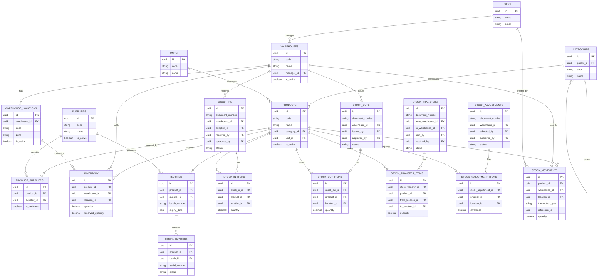

# 📦 ERD – Inventory & Warehouse Management System

Dokumen ini berisi **Entity Relationship Diagram (ERD)** untuk sistem
**Inventory & Warehouse Management** dengan dukungan:

- Multi Warehouse
- Multi Location (Bin/Rack)
- Batch & Serial Tracking
- Stock In / Out / Transfer / Adjustment
- Stock Ledger (Audit Trail)

---

## 🧠 Konsep Umum

- `inventory` → menyimpan **stok terkini**
- `stock_movements` → menyimpan **riwayat pergerakan stok**
- Semua transaksi menggunakan **header–detail pattern**
- Perubahan stok hanya terjadi pada **status APPROVED / RECEIVED**

---

## 📊 ERD Diagram (Mermaid)

