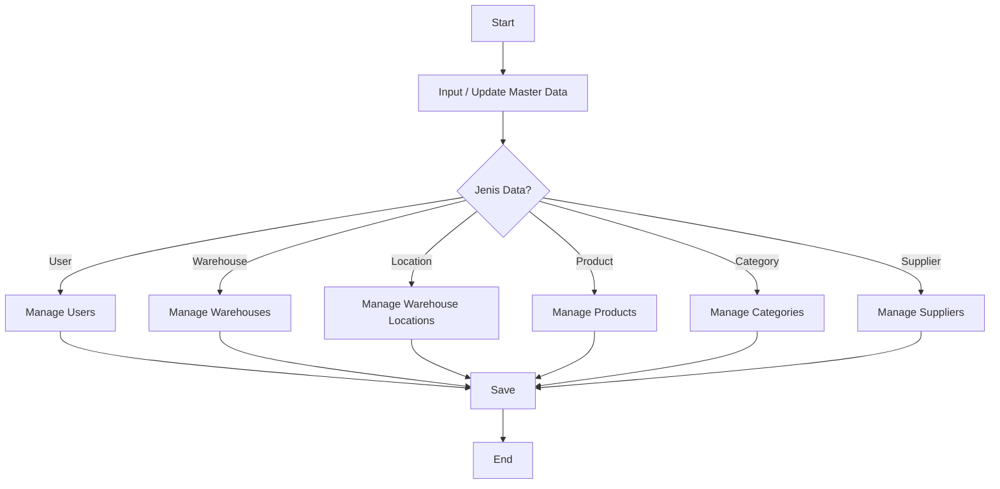
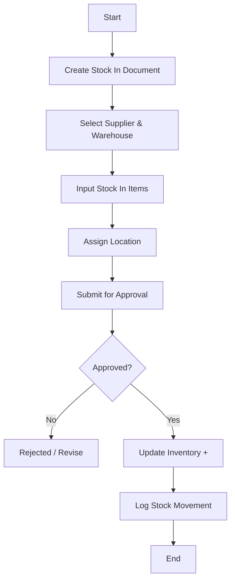
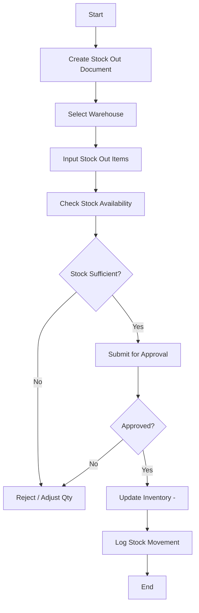
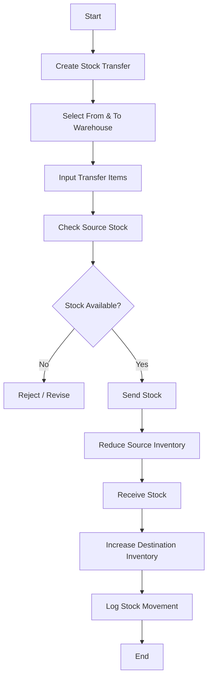
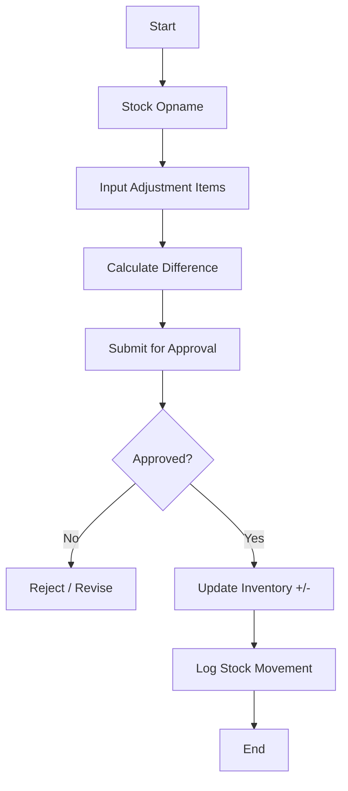
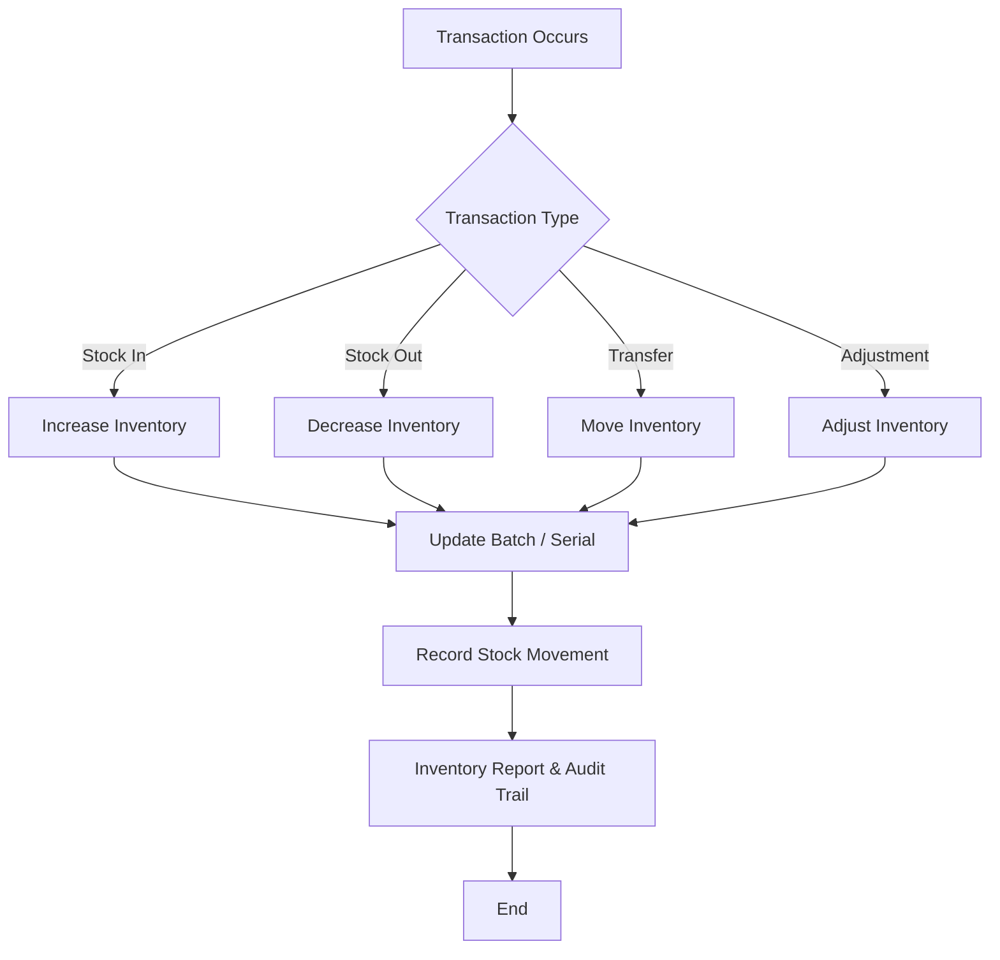

# Inventory Management – Business Process Flow

## 1. Master Data Management

---

## 2. Stock In (Penerimaan Barang)

---

## 3. Stock Out (Pengeluaran Barang)

---

## 4. Stock Transfer (Mutasi Stok)

---

## 5. Stock Adjustment (Penyesuaian Stok)

---

## 6. Inventory Tracking & Traceability

