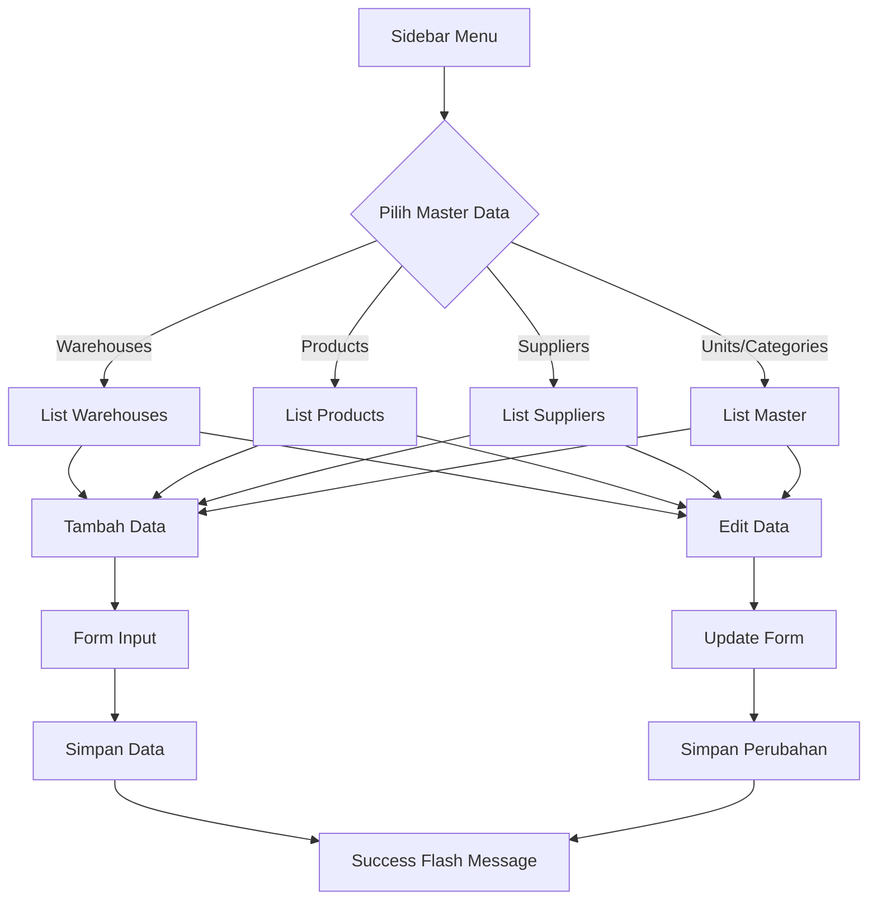
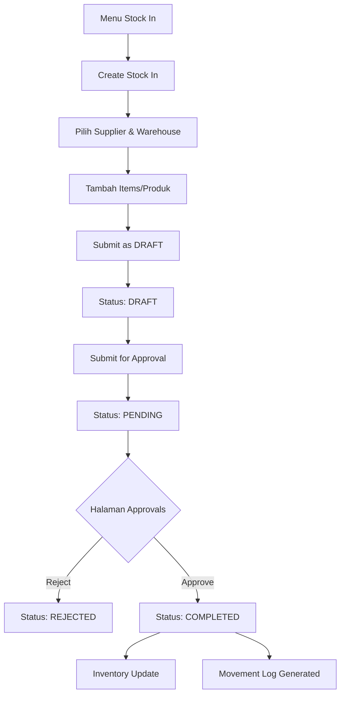
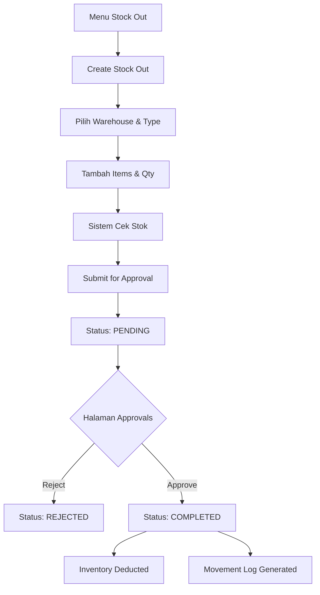
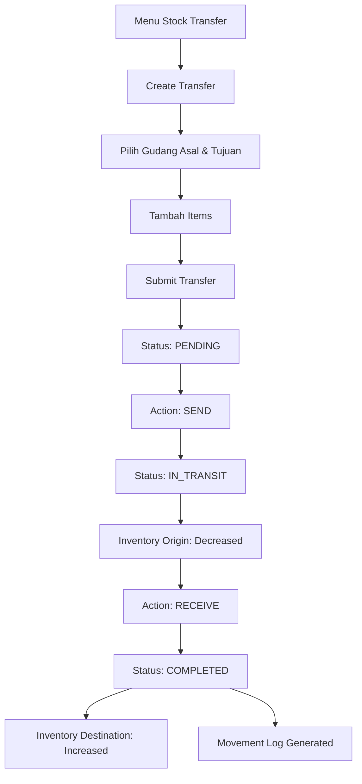
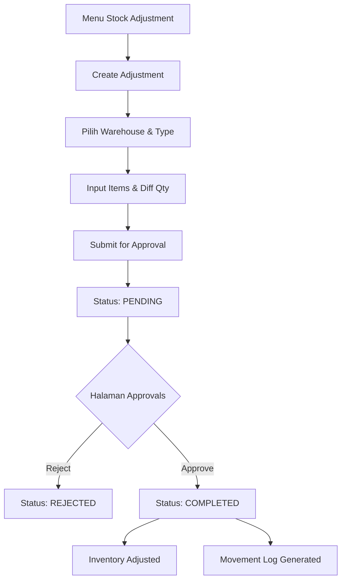
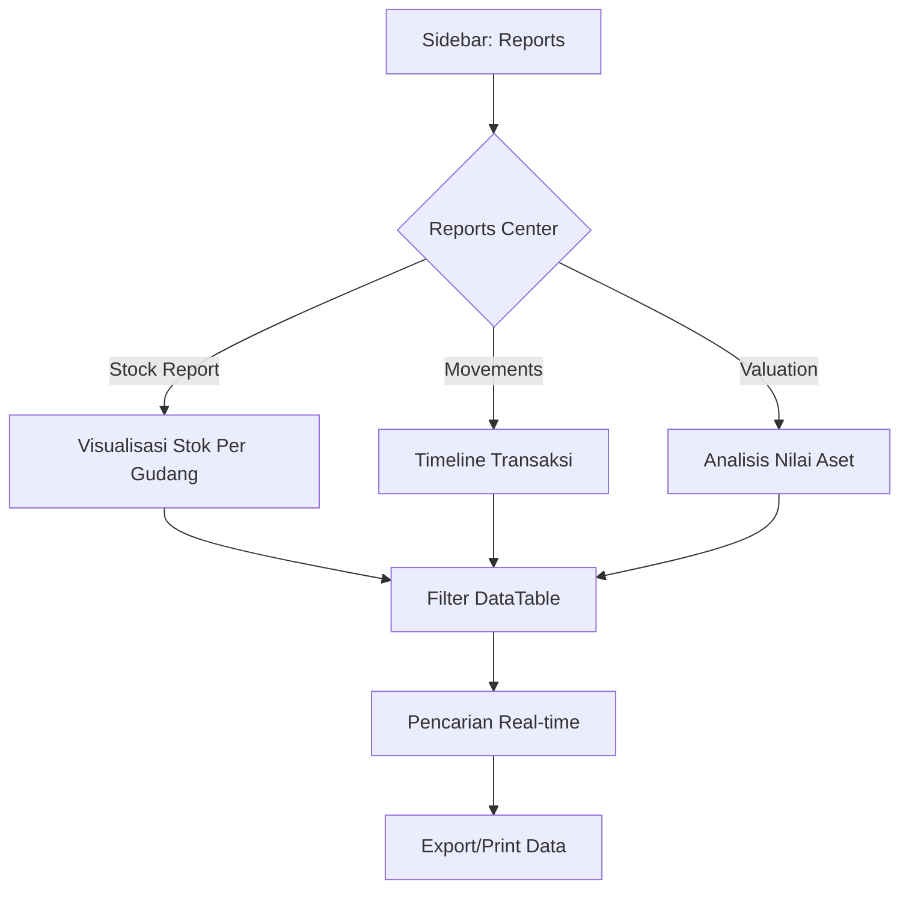
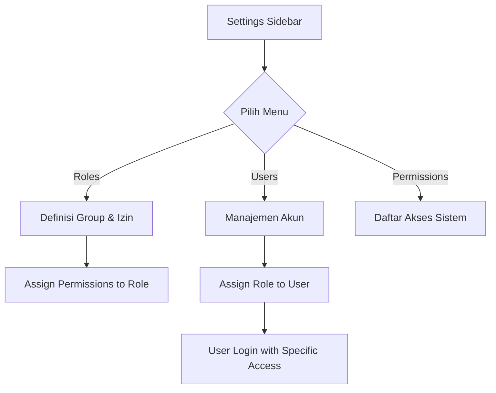

# User Flow Diagrams - Agusto WMS

Dokumen ini menjelaskan alur pengguna (user flow) untuk setiap fitur utama dalam Agusto WMS.

## 1. Alur Master Data (Warehouses, Products, Suppliers, etc.)
Alur standar untuk pengelolaan data master.

---

## 2. Alur Transaksi Stock In
Proses penerimaan barang masuk ke gudang.

---

## 3. Alur Transaksi Stock Out
Proses pengeluaran barang dari gudang.

---

## 4. Alur Stock Transfer
Proses pemindahan stok antar gudang.

---

## 5. Alur Stock Adjustment
Proses penyesuaian stok (opname/koreksi).

---

## 6. Alur Laporan (Reports)
Akses data analitik dan riwayat.

---

## 7. Alur Manajemen Akses (Admin)
Pengelolaan pengguna dan izin.

