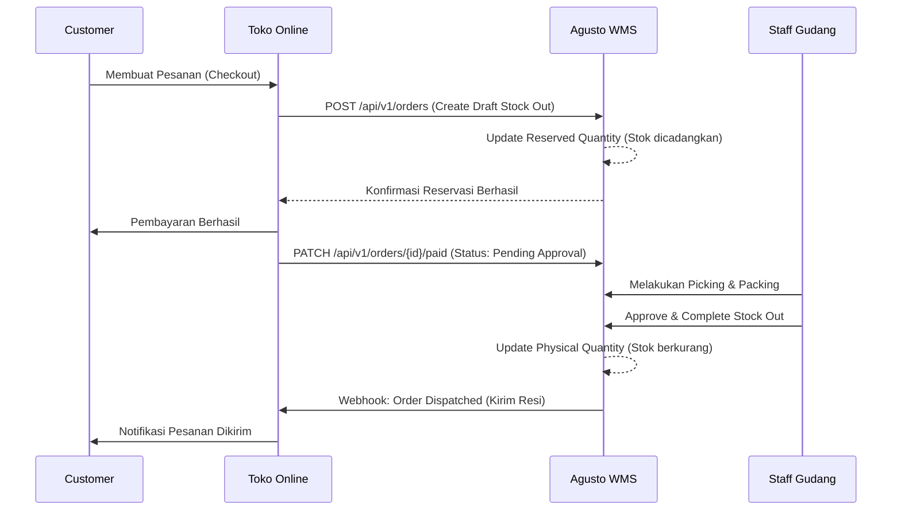

# Rancangan Integrasi: Agusto WMS x Toko Online (E-Commerce)

Dokumen ini menjelaskan teknis dan alur integrasi antara Agusto WMS dengan aplikasi Toko Online.

## 1. Konsep Dasar
Toko Online bertindak sebagai "Frontend Penjualan", sedangkan Agusto WMS bertindak sebagai "Single Source of Truth" untuk data stok dan pemenuhan pesanan (*order fulfillment*).

## 2. Arsitektur Integrasi
Integrasi dilakukan melalui **RESTful API** yang disediakan oleh Agusto WMS.

### A. Sinkronisasi Produk & SKU
*   **WMS ke Toko Online**: Agusto mengirimkan daftar produk yang tersedia untuk dijual.
*   **SKUs Mapping**: `product_code` di Agusto dipetakan ke `SKU` di platform Toko Online.

### B. Sinkronisasi Stok (Real-time)
*   Agusto menyediakan endpoint `GET /api/v1/inventory/{sku}`.
*   **Webhooks**: Agusto akan mengirimkan notifikasi ke Toko Online setiap kali ada perubahan stok (misal: setelah *Stock In* atau *Adjustment*) agar Toko Online memperbarui tampilan stoknya.

## 3. Alur Transaksi (Workflow)

## 4. Endpoint API yang Dibutuhkan (Sisi Agusto)

| Method | Endpoint                     | Fungsi                                                 |
| :----- | :--------------------------- | :----------------------------------------------------- |
| `GET`  | `/api/v1/products`           | Mengambil daftar produk aktif                          |
| `GET`  | `/api/v1/stock-levels`       | Mengambil data stok tersedia (Total - Reserved)        |
| `POST` | `/api/v1/orders`             | Membuat transaksi *Stock Out* baru dari pesanan online |
| `GET`  | `/api/v1/orders/{id}/status` | Mengecek status pemenuhan pesanan di gudang            |

## 5. Keamanan
*   **API Key / Bearer Token**: Setiap request dari Toko Online harus menyertakan token otentikasi yang valid.
*   **Rate Limiting**: Membatasi jumlah request untuk mencegah serangan DDoS.
*   **IP Whitelisting**: Hanya menerima request dari IP server Toko Online.

## 6. Penanganan Masalah (Error Handling)
*   **Stok Habis**: Jika saat checkout stok di Agusto ternyata sudah diambil transaksi lain, API akan mengembalikan error `422 Unprocessable Entity`.
*   **Retry Mechanism**: Jika webhook gagal terkirim karena server Toko Online down, Agusto akan mencoba mengirim ulang (retry) sebanyak 3 kali.

---
*Dibuat untuk: Pengembangan Ekosistem Agusto WMS*
